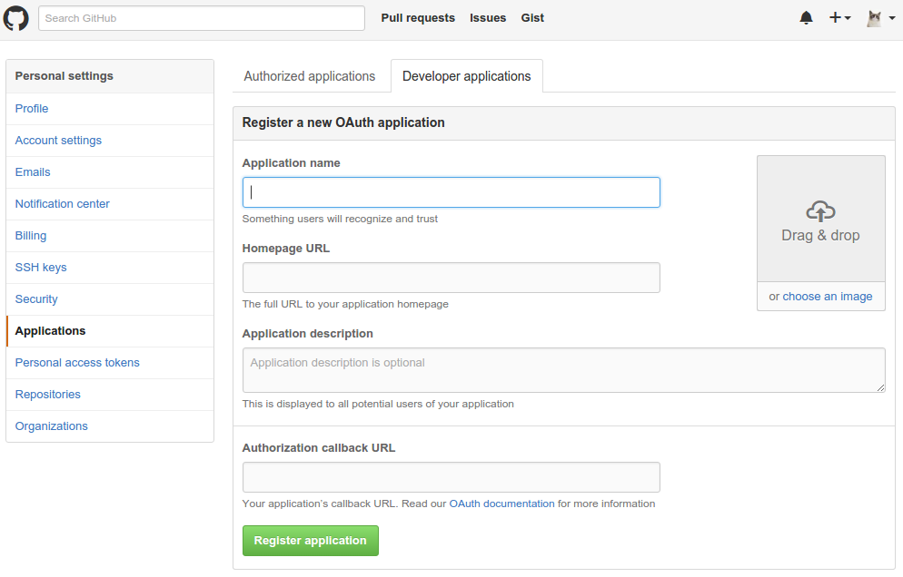
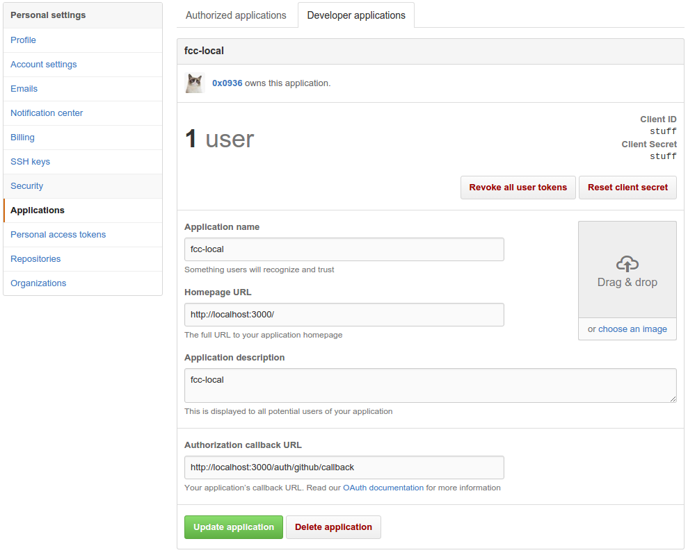

# Overview
This guide will help you log in to your local FCC site using your GitHub account. This process should be similar for logging in with other social media accounts. This guide assumes you already have a local copy of FCC up and running.

[//]: # (camperbot stops parsing after 20 lines or the first level 2 heading)
### TL;DR
1. Register a new OAuth application at https://github.com/settings/developers
2. Homepage field: `http://localhost:3000/`
3. Callback field: `http://localhost:3000/auth/github/callback`
4. Copy/paste the Client ID and Client Secret into your `.env` file
5. Use port 3000 when viewing your local FCC site

## Need Help?
If you need help getting FCC setup on your local machine, here are a few useful links to help you get started:
- [How To Fork And Maintain a Local Instance of Free Code Camp](https://github.com/FreeCodeCamp/FreeCodeCamp/wiki/How-To-Fork-And-Maintain-a-Local-Instance-of-Free-Code-Camp)
- [How To Create a Pull Request for Free Code Camp](https://github.com/FreeCodeCamp/FreeCodeCamp/wiki/How-To-Create-A-Pull-Request-for-Free-Code-Camp)
- [Open Issues Labeled as Help Wanted](https://github.com/FreeCodeCamp/FreeCodeCamp/labels/help%20wanted)

Free Code Camp Issue Mods and staff are on hand to assist with Pull Request related issues on our [Help Contributors Chat Room](https://gitter.im/FreeCodeCamp/HelpContributors)

## Disclaimer
While the output from running `$ gulp` mentions the **Access Port** is 3001, I have only successfully logged in with GitHub at port 3000 &dash; the **Proxy Port**. If you understand how to log in using other ports, please consider submitting a pull request on this wiki.

## Log In Using Your GitHub Account
1. Register a new OAuth application at https://github.com/settings/developers and click **Register new application**
  
*Alternatively*, click your **Profile Picture** => **Settings** => **Applications** => **Register new applications** => **Developer applications** tab
  

  

2. Fill out OAuth application fields
  * **Application name** - choose any name, like `fcc-local`
  * **Homepage URL** - set to `http://localhost:3000/`
  * **Application description** - optional
  * **Authorization callback URL** - set to `http://localhost:3000/auth/github/callback`
  

3. Click **Register application** to see the newly registered application page with your Client ID and Client Secret
  

  

4. Copy and paste your Client ID and Client Secret into your `.env` file.
  
*Note: your Client ID and Client Secret will be long alphanumeric values.*
  

## Finished
Congratulations! You can now successfully log into your local FCC site using your GitHub account.
