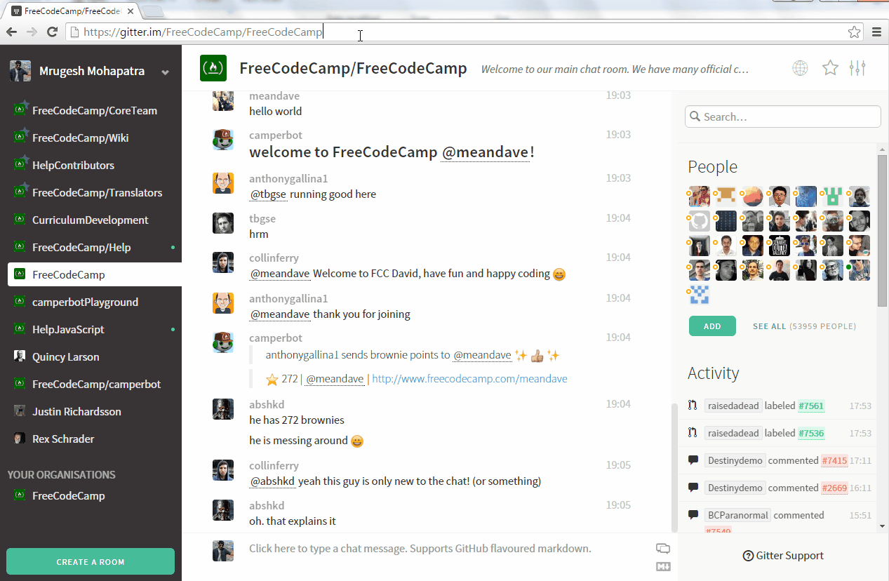
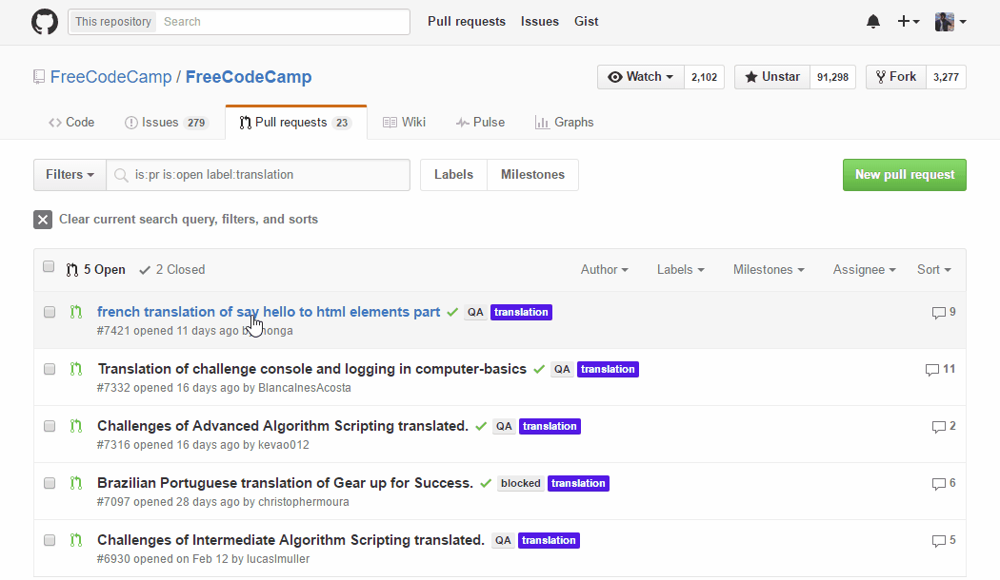

# Translations Guide

## Guidelines for translating FreeCodeCamp to any language

Thank you so much for your interest in translating FreeCodeCamp. Reading this document is recommended for participating in a collective effort to bring FreeCodeCamp to more and more people all around the world.

## How to Contribute to Translations?

<<<<<<< HEAD
* Amharic [FreeCodeCamp/TranslationAmharic](https://gitter.im/FreeCodeCamp/TranslationAmharic)
* Arabic [FreeCodeCamp/TranslationArabic](https://gitter.im/FreeCodeCamp/TranslationArabic)
* Bahasa Indonesia : [FreeCodeCamp/TranslationBahasaIndonesia](https://gitter.im/FreeCodeCamp/TranslationBahasaIndonesia)
* Bangla: [FreeCodeCamp/TranslationBangla](https://gitter.im/FreeCodeCamp/TranslationBangla)
* Brazilian Portuguese: [FreeCodeCamp/BrazilianPortuguese](https://gitter.im/FreeCodeCamp/BrazilianPortuguese)
* Chinese (Simplified): [FreeCodeCamp/TranslationChinese](https://gitter.im/FreeCodeCamp/TranslationChinese)
* French [FreeCodeCamp/TranslationFrench](https://gitter.im/FreeCodeCamp/TranslationFrench)
* German [FreeCodeCamp/TranslationDeutsch](https://gitter.im/FreeCodeCamp/TranslationDeutsch)
* Hindi [FreeCodeCamp/TranslateHindi](https://gitter.im/FreeCodeCamp/TranslateHindi)
* Korean [StephenMayeux/koreantranslations](https://gitter.im/StephenMayeux/koreantranslations)
* Russian [FreeCodeCamp/TranslationRussian](https://gitter.im/FreeCodeCamp/TranslationRussian)
* Serbian [FreeCodeCamp/TranslateSerbian](https://gitter.im/FreeCodeCamp/TranslateSerbian)
* Spanish [AlexTrapp/FreeCodeCampEspa%C3%B1ol](https://gitter.im/AlexTrapp/FreeCodeCampEspa%C3%B1ol)
* Turkish [FreeCodeCamp/TranslateTurkish](https://gitter.im/FreeCodeCamp/TranslateTurkish)
=======
There are various ways in which you can contribute collaboratively to the translations. Every translation effort usually follows the workflow below.
>>>>>>> bbf4745e266e03724175b46f7e449db46250e637

- [x] Discuss in language specific Translations Chat Rooms.
- [x] Review the work of another translator.
- [x] Create `Translation` issues to track the progress.
- [x] Do Translations.
- [x] Create Pull requests to add the Translations to code base.

> _Pro tip: You can contribute to any or all of above phases in the work flow as per your interest._

## Discuss in language specific Translations Chat Rooms.

> Many people want to collaborate, but get intimidated by the learning curve of Git and "Contribution Procedures" in general. While it's not difficult to get started, it's always nice to have someone to help you if you get stuck. These chat rooms are the best places to communicate whenever you need any assistance.

Please join the gitter channel [**`[FreeCodeCamp/Translators]`**](https://gitter.im/FreeCodeCamp/Translators) and also join the channel for translators of your specific language (if it exists):

| Language | Chat Room |
| -------- | --------- |
| Amharic  | [FreeCodeCamp/TranslationAmharic](https://gitter.im/FreeCodeCamp/TranslationAmharic) |
| Arabic   | [FreeCodeCamp/TranslationArabic](https://gitter.im/FreeCodeCamp/TranslationArabic) |
| Bangla   | [FreeCodeCamp/TranslationBangla](https://gitter.im/FreeCodeCamp/TranslationBangla)|
| Brazilian Portuguese | [FreeCodeCamp/BrazilianPortuguese](https://gitter.im/FreeCodeCamp/BrazilianPortuguese) |
| Chinese (Simplified) | [FreeCodeCamp/TranslationChinese](https://gitter.im/FreeCodeCamp/TranslationChinese) |
| French   | [FreeCodeCamp/TranslationFrench](https://gitter.im/FreeCodeCamp/TranslationFrench) |
| German   | [FreeCodeCamp/TranslationDeutsch](https://gitter.im/FreeCodeCamp/TranslationDeutsch) |
| Hindi    | [FreeCodeCamp/TranslateHindi](https://gitter.im/FreeCodeCamp/TranslateHindi) |
| Korean   | [StephenMayeux/koreantranslations](https://gitter.im/StephenMayeux/koreantranslations) |
| Russian  | [FreeCodeCamp/TranslationRussian](https://gitter.im/FreeCodeCamp/TranslationRussian) |
| Serbian  | [FreeCodeCamp/TranslateSerbian](https://gitter.im/FreeCodeCamp/TranslateSerbian) |
| Spanish  | [AlexTrapp/FreeCodeCampEspañol](https://gitter.im/AlexTrapp/FreeCodeCampEspa%C3%B1ol) |
| Turkish  | [FreeCodeCamp/TranslateTurkish](https://gitter.im/FreeCodeCamp/TranslateTurkish) |

If it doesn't exist, we recommend you to [create a chat room on Gitter](https://gitter.im/home/#createroom) exclusive for the language that you're working on, where you can communicate and discuss the status of translations and coordinate efforts. Help regarding the technical processes should also be provided in the chat room.

> _Pro tip: Share the Chat Room link at [**`[FreeCodeCamp/Translators]`**](https://gitter.im/FreeCodeCamp/Translators) and other places to invite more translators and reviewers._

If you need help in creating a chat room or just getting started, we advice you visit the official translators chat room of FreeCodeCamp at [**`[FreeCodeCamp/Translators]`**](https://gitter.im/FreeCodeCamp/Translators). You could also go there to recruit new translators for your language every once in a while. Its frequented by many campers and is a great place to connect with like minded translators.

[](https://gitter.im/FreeCodeCamp/Translators)

## Review the work of another translator

When a translator completes or advances a translation he/she would create a pull request, that must be reviewed by another peer. A [Pull Request](How-To-Create-A-Pull-Request-for-Free-Code-Camp) or PR is a method of submitting proposed changes to the code base.

Translators would post a link to their pull request to the chat room of the translation asking for reviews.  If you see a message requesting review of a translation, visit the pull request and find the tab `"Files changed"` right under the PR's title. There you will be able to see the changes in the translation in two columns, to the left you will see the original file and to the right the changes proposed.

If you want to suggest an improvement to the translation in one line (a.k.a inline commenting), click on the `+` (plus sign) that appears next to the line number when you move the cursor over, in the dialog that pops up you can write your suggestion in the language of the translation.



## Create `Translation` issues to track the progress.

Before starting translations of challenges GitHub issues need to be created specific to the language of translation. Translators should create issues with the details of the challenges to be tracked in that particular issue.

[](https://gitter.im/FreeCodeCamp/Translators)

**FreeCodeCamp's [Issues Section](https://github.com/FreeCodeCamp/FreeCodeCamp/issues), has mainly two kinds of requests related with the translation of the challenges:**

- Some to start the translation of one of the files in the directory `seeds/challenges`. See for example: [Issue #4544](https://github.com/FreeCodeCamp/FreeCodeCamp/issues/4544)

[](https://gitter.im/FreeCodeCamp/Translators)

- Other issues requesting to verify or to update an existing translation of one the files in directory `seeds/challenges`. For example: [Issue #6517](https://github.com/FreeCodeCamp/FreeCodeCamp/issues/6517). These can be reopened when there is a change in the English version of the challenge.

> _Pro Tip : You can quickly check issues related to translation by looking for the [`translation`](https://github.com/FreeCodeCamp/FreeCodeCamp/issues?q=is%3Aissue+is%3Aopen+label%3Atranslation)_ label.

If you see issues already open for the challenges, then you could proceed to working on them.

OR

If you can't see any related issues, or that can't be reopened, then start by __creating__ them for the challenge category you would like work on. Remember to discuss in the Chat room for a confirmation of the challenges that you would like to add to the issue.

> _Pro Tip : Follow the example shown above, for consistency in the formatting of the issues, like adding checklists for challenges._

## Do Translations.

When you want to work on any of the translations, we encourage you to leave a comment like `"Working on it"` on the [open/ongoing translation issues](https://github.com/FreeCodeCamp/FreeCodeCamp/issues?q=is%3Aissue+is%3Aopen+label%3Atranslation). This will notify the contributors about your interest in doing the translation.

Check the technical steps in this guide for doing translations.

After this you will have up to 15 days to create a [Pull Request](How-To-Create-A-Pull-Request-for-Free-Code-Camp) with the proposed translation or updating an existing one.

We invite you to check the directories and files in  [`seeds/challenges`](https://github.com/FreeCodeCamp/FreeCodeCamp/tree/staging/seed/challenges) for doing translations.

> _Pro Tip : Remember to discuss your progress in chat rooms. Being active in the chat, reflects that you are working on it!_

### Technical procedure to create a translated file

 1. [Install git](https://www.git-scm.com/) on your computer and [create an account on GitHub](https://github.com/join) if you don't have one already.

 2. From your GitHub account [_fork_](https://help.github.com/articles/fork-a-repo) the FreeCodeCamp repository ([https://github.com/FreeCodeCamp/FreeCodeCamp](https://github.com/FreeCodeCamp/FreeCodeCamp)). That's it! Now, you have a _fork_ of the original repo under your account.

 

 3. Launch a terminal/command prompt and clone a local copy of your fork to your computer (replace the word `USERNAME` with your github account's username):

 ```sh
 git clone --depth=1 https://github.com/USERNAME/FreeCodeCamp.git
 cd FreeCodeCamp
 ```
 [Learn more on forking ...](https://help.github.com/articles/fork-a-repo/)

 4. Now, on GitHub, go to the [_Issues_ Section](https://github.com/FreeCodeCamp/FreeCodeCamp/issues) of the FreeCodeCamp repository and look for the [open/ongoing translation issues](https://github.com/FreeCodeCamp/FreeCodeCamp/issues?q=is%3Aissue+is%3Aopen+label%3Atranslation), and as mentioned in the **Do Translations** section above and leave a comment like `"Working on it"`, if no one is working on it (or has been left unattended for more than 2 weeks). As always confirm in the Chat rooms when you need guidance.

 5. In your forked repository, create a _branch_ with a name such as `"translate/LG-translation-XXX-YYY"` where `Lg` is the abbreviated name of the language you're working on, and `XXX-YYY` is the name of the file you're going to modify.

 ```sh
 git checkout -b translate/Es-translation-basic-javascript
 ```

 In the example above `Es` is the language code for Español (Spanish) and `basic-javascript` is the name of the JSON file, that is to be transated. Refer the list of [Two letter codes](https://en.wikipedia.org/wiki/List_of_ISO_639-1_codes) for your language, for clarity.

 [Learn more on branching ...](https://github.com/Kunena/Kunena-Forum/wiki/Create-a-new-branch-with-git-and-manage-branches)

 6. Find the `JSON` file in the `seeds/challenges` directory in your local copy. Find the challenge of your interest and modify it by adding the name of the challenge in `"titleLg"` and its description in `"descriptionLg"`, where `"Lg"` is the language of your choice.

 It's important to keep the proper syntax of the `JSON` file (a.k.a linting the file). You can verify this by installing `node.js` and passing the `JSON` file to the interpreter. For example: `node seeds/challenges/basic-javascript.json`.

 You will also be able to verify the syntax by copying and pasting the content of the file in [http://jsonlint.com](http://jsonlint.com).

 7. When you're done, _commit_ your changes with a brief description in English (regardless of the language). Afterwards, _push_ the changes to your fork:

 ```sh
 git commit -m "Challenges of Basic Javascript translated." seed/challenges/basic-javascript.json
 git push origin add/Es-translation-basic-javascript
 ```

 [Learn more on pushing changes ...](https://help.github.com/articles/pushing-to-a-remote/)


If you think that you can't continue for a while with the translation, you can leave a comment on the same issue, indicating that another person should continue. You can push your changes so far so the next person won't duplicate your hard work.

```
//////// TODO UPDATE Things below ////////
```

## Create Pull requests to add the Translations to code base.

As mentioned earlier, a [Pull Request](How-To-Create-A-Pull-Request-for-Free-Code-Camp) or PR is a method of submitting proposed changes to the code base.

8. Afterwards, from the webpage of your fork in github.com, make a _pull request_ to the branch called `staging` in the main repository (see the [help](https://help.github.com/articles/creating-a-pull-request/)). Add "Closes #yyyy" to the description area in the Pull request where `yyyy` is the issue no of the original issue that was created for the challenge translation. Doing this will automatically close the open issue when the Pull request is merged.

## Guidelines and Resources


### General guidelines
- Try not to be too formal yet not too casual, just to keep things friendly.
- In order to make contents more understandable for native speakers of your target language (think of those who don't speak English), translate as much as you can, try to use a word in English only if it is already widely used in the countries where your target language is spoken.

### Glossary
It is efficient if all the translators working on the same language create a glossary showing the translation of words in English employed in FreeCodeCamp's challenges. Sometimes there is more than one way of translating some terms, and regional differences might create confusion (for example, some terms might differ between Spanish from Spain and from Latin America, or between the French language employed in Canada and in France).  Be democratic! Choose the most appropriate translation by voting and keep a record of the results. One example of such record can be found here: [FreeCodeCamp Glossary (English to Spanish)](https://docs.google.com/spreadsheets/d/1c60Sl4MAAsZ7biCPgur7A4aVqhErIfwrE1SulPqbOGo/edit#gid=0) Use the chat room for discussing the glossary, so no one will miss anything.

### If you need some help with the Google Translator Toolkit
You may find help automating the translation process by employing the Google Translator Toolkit, please see: [Spanish guide](https://github.com/vtamara/fcc_trad)

### Creating a test instance of FreeCodeCamp
Seeing the final product as you advance with the translation can help you to stay motivated. That's why it is a good idea to create a test instance of FreeCodeCamp where you can include the most recent changes of the translation of the language you're working on and use FreeCodeCamp including those changes. The following test instance was created for the Spanish version of FreeCodeCamp: [Map](https://defensor.info:3000/map) In order to create a test instance, go through the following steps:
1. Verify with the other translators of the same language you're working on if a test instance has been created before
2. Follow the instructions of [Contributing page](https://github.com/FreeCodeCamp/FreeCodeCamp/blob/staging/CONTRIBUTING.md) be sure you can see a running instance in English
3. Follow the changes shown in [this commit](https://github.com/FreeCodeCamp/FreeCodeCamp/commit/d36e33f3938ddd079931a5fb2bc5dc6db37667e5) but instead of `descriptionEs` and `nameEs` use the keys of your language (e.g `descriptonFr` and `nameFr`)

### References
- [Documentation of the source code of FreeCodeCamp.](https://github.com/FreeCodeCamp/FreeCodeCamp/blob/staging/README.md)
- [Pull Request Contribute](https://github.com/FreeCodeCamp/FreeCodeCamp/wiki/Pull-Request-Contribute)
- [Help files for translating FreeCodeCamp's challenges and indications using Google Translator Toolkit.](https://github.com/vtamara/fcc_trad/blob/master/README.md)

--------------------------------------------------------------------------------

If you find it useful, you can translate these instructions to your language and adapt them for your translation team (see for example, [original in Spanish.](https://github.com/vtamara/fcc_trad/blob/master/Recomendaciones.md))

*This guide is based on [this writeup](https://github.com/vtamara/fcc_trad/blob/master/Recomendaciones.EN.md).*
